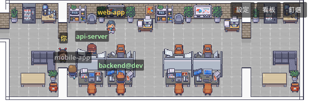
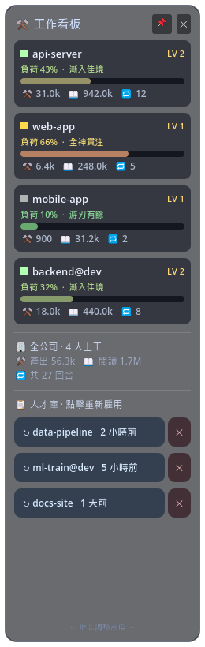

<p align="center">
  
</p>

# Deskbots — Claude Code 機器人辦公室地圖

[English](README.md) | **繁體中文**

把每個正在執行的 Claude Code session 變成俯瞰辦公室地圖上的小機器人：
工作時坐在自己座位、等你授權時走到等待區滑手機、忙完走去休息室看書。
透明、無邊框、可置頂地疊在桌面上，一眼看出哪個專案在忙、哪個在等你。

<p align="center">
  <br>
  
</p>

- **工作看板**：每個 session 的負荷量表（context 佔用）、LV、產出/閱讀 token、回合數
- **對話卡**：點機器人看最近一輪 Q&A，直接送訊息/斜線指令回終端、一鍵叫出終端視窗
- **人才庫**：近期用過的專案一鍵重新雇用（`claude -c` 接續上次對話）
- **SSH 多伺服器**：遠端機器的 Claude session 也上圖；遠端專案一鍵開 VS Code Remote 直達工作目錄
- **乾淨生命週期**：開＝自動裝 hooks，關＝自動還原 `~/.claude/settings.json`，不留痕跡

## 架構

```
資料層 (Python，純標準庫)                   渲染層 (Godot 4.6，OpenGL Compatibility)
Claude Code hooks
  └ app/emit.py <EVENT>                     透明置頂疊層視窗，每 0.4s 輪詢
      └ 寫 runtime/sessions/<id>.json  ──→  每 session 一隻機器人 (BOT1~9)
app/usage_poll.py（常駐）                    依狀態走位/動畫、A* 繞牆尋路
  └ usage.json / rehire.json           ──→  工作看板、人才庫
app/ssh_bridge.py（常駐）
  └ ssh <host> remote_agent.py          ──→  遠端 session 鏡像進同一資料夾
app/winfocus.py  ←──（對話卡送訊息/叫終端：Win32 聚焦 + 鍵盤注入）
```

**核心設計：檔案就是 IPC。** hook 只寫、Godot 只讀、winfocus 只碰視窗，
行程間零耦合，任何一邊掛掉都不拖垮別人。

| 文件 | 內容 |
|------|------|
| [docs/USAGE.zh-TW.md](docs/USAGE.zh-TW.md) | **使用手冊**：操作、狀態表、看板/對話卡/設定卡、SSH、debug、疑難排解 |
| [docs/ARCHITECTURE.md](docs/ARCHITECTURE.md) | **架構說明**：資料流、終端 hwnd 抓取、鍵盤注入、SSH 橋接、失敗模式 |
| [docs/TILED.md](docs/TILED.md) | **地圖模組製作**：Tiled 圖層規則、錨點、改佈局/加新模組 |
| [assets/README.md](assets/README.md) | **素材自備說明**：要放哪些檔、格式、來源 |

## 需求

| 項目 | 說明 |
|------|------|
| Windows 10/11 | winfocus（聚焦/鍵盤注入）與啟動器是 Windows 限定 |
| Python 3.8+（`py` launcher） | 資料層全部純標準庫，零相依 |
| [Claude Code](https://claude.com/claude-code) CLI | 被觀察的本體 |
| Godot 4.6 | 二擇一：裝編輯器（開發），或用打包好的 `godot\Deskbots.exe`（免裝） |
| （選用）素材 PNG | **開箱即用**內建原創簡約畫風；放入 LimeZu 素材自動升級畫質（[assets/README.md](assets/README.md)） |
| （選用）VS Code + Remote-SSH、OpenSSH | SSH 多伺服器功能用 |

## 安裝與啟動

```
git clone https://github.com/james10120/Deskbots.git && cd Deskbots
（選用：放入 LimeZu 素材 PNG 升級成完整像素風 — assets/README.md）
```

**直接雙擊 `godot\Deskbots.exe`**（打包版）即可。它會自管完整生命週期：開啟時自動把
hooks/statusLine 併入全域設定，**關閉地圖後自動還原、停背景行程、清 runtime**，背景輪詢也由它自己起停。
要被觀察的 Claude session 請在**地圖開啟後**才啟動。
（萬一 exe 被強殺來不及還原，跑一次 `py app\apply_settings.py --remove`；安裝是 idempotent，下次開啟也會自動重清。）

**`app\run_deskbots.cmd`** 做同樣的事，但走 PowerShell 的 `try/finally`，連崩潰都保證收尾——
想要這層保險、或從原始碼跑（沒有打包 exe）時用它。

**常駐模式**：先跑一次 `py app\apply_settings.py`（idempotent、會備份 `.bak`），
之後雙擊 **`app\start_map.cmd`** 只開地圖、關閉不動全域設定。卸載：`py app\apply_settings.py --remove`。

`run_deskbots.cmd` 找 Godot 的順序：`godot\Deskbots.exe`（打包版）→ 環境變數 `DESKBOTS_GODOT` → PATH → 常見安裝位置。

## 打包成免安裝應用

```
powershell -File app\package.ps1 -Version 1.0.0
```

需要 Godot 4.6 編輯器 + 同版 export templates。產出 `dist\Deskbots-<版本>-win64.zip`，
解壓 → 雙擊 `godot\Deskbots.exe` 即用（不需安裝 Godot；Python 仍需要）。打包版已內嵌烘好的地圖與加密素材，開箱即跑。

## SSH 多伺服器

在多台機器（VS Code Remote-SSH 那種）開發時，遠端的 Claude session 也能上圖：

1. 地圖右上「設定」→ SSH 伺服器 → 輸入 `user@ip` → **＋ 連線安裝**
   （開新視窗自動：產生/推送 SSH 金鑰（輸一次密碼）→ 部署遠端 agent + hooks → 登記）
2. 完成後遠端 session 以「`專案@機器`」出現；對話卡可看內容、一鍵「在 VS Code 開啟」
3. 人才庫會列出遠端機器的近期專案，點一下開 VS Code Remote 直達該工作目錄

指令版：`py app\remote_install.py user@ip --bootstrap [--label 名字]`（`--remove` 卸載遠端 hooks）。
遠端需求：Linux/macOS、python3、sshd；本地連線必須金鑰免密碼（bootstrap 會自動設好）。

## 檔案

```
app/
  emit.py            hook 進入點：算狀態、抓終端 hwnd、寫 session JSON（絕不阻塞）
  states.py          共用：路徑、狀態機、時間衰減、session 檔讀寫
  statusline.py      Claude Code 底部狀態列
  usage_poll.py      常駐：token 用量（usage.json）+ 本地人才庫（rehire.json）
  ssh_bridge.py      常駐：SSH 多伺服器鏡像（servers.json 熱載入、bridge.json 狀態）
  remote_agent.py    （部署到遠端）串流該機 session 快照與近期專案
  remote_install.py  一鍵部署遠端（--bootstrap 含金鑰設定）；add_server.cmd 為遊戲入口
  winfocus.py        Win32：抓終端視窗、聚焦、鍵盤注入（支援中文）
  apply_settings.py  hooks/statusLine 裝入/移出全域設定（idempotent、非破壞）
  bake_map.py        Tiled 模組拼接烘焙（COMPOSITION 佈局、MODULE_ANCHORS 座位錨點）
  run_deskbots.*     乾淨生命週期啟動器；start_map.cmd 常駐模式；package.ps1 打包
godot/
  main.gd            主迴圈：session 掃描、角色行為、視窗訊號接線
  office_map.gd      地圖渲染、A* 走格、座位/休息/等待地理（吃烘焙資料，零寫死）
  detail_window.gd   對話卡；usage_board.gd 工作看板；settings_window.gd 設定卡
  drag_window.gd     無邊框透明卡片視窗共用底座；paths.gd / util.gd 共用
assets/              素材（PNG 自備，見 assets/README.md）；tiled/*.tmj 地圖模組
config/              servers.json（SSH 伺服器清單，本機限定不入庫）
runtime/             執行期狀態（gitignored，啟動器離開時清理）
```

## 調整

- **辦公室佈局**：`app/bake_map.py` 的 `COMPOSITION`（模組由左到右；座位/休息/等待點自動算）
- **模組錨點**：同檔 `MODULE_ANCHORS`；地圖模組製作見 [docs/TILED.md](docs/TILED.md)
- **縮放/座位微調**：`godot/office_map.gd` 的 `SCALE`、`SEAT_UP_DY/DOWN_DY`
- debug：`--grid` 顯示格線+錨點標記、`--shot` 自動截圖後退出

## 授權

程式碼 MIT（見 [LICENSE](LICENSE)）。美術素材（LimeZu Modern Interiors / Modern Office Revamped）
**不含在本 repo**，依 LimeZu 條款另行取得。
